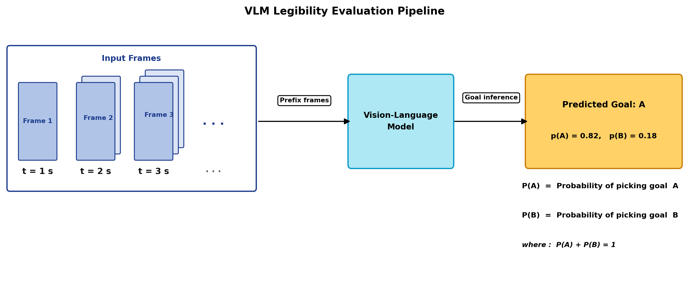
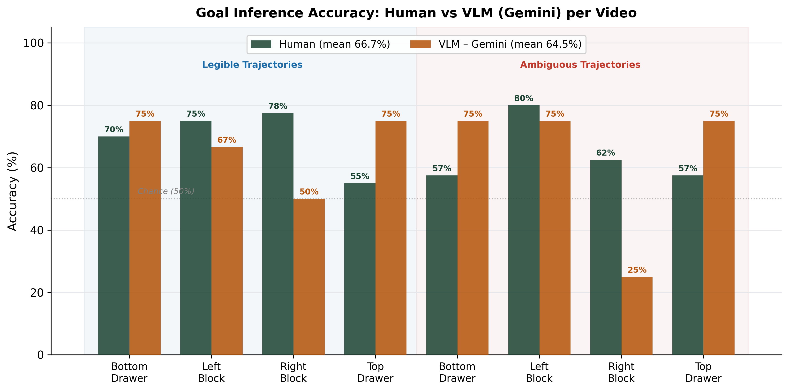
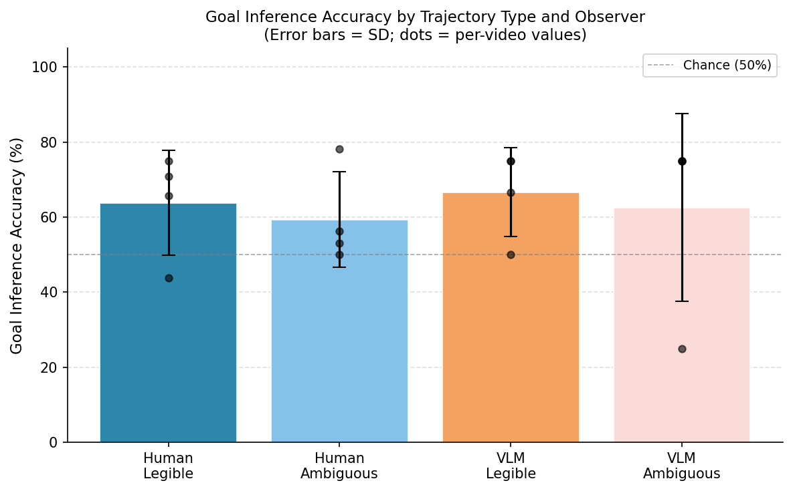

# VLM Goal Inference for Robot-Motion Legibility

[](https://www.python.org/downloads/)
[](LICENSE)

This repository asks whether a vision-language model can tell which goal a robot is reaching for just from watching its motion. It is the evaluation engine behind my MS thesis, *Vision-Language Models as Proxies for Human Judgment of Robot Motion Legibility* (Arizona State University, 2026). It feeds rendered frames of robot manipulation videos to frontier VLMs (Gemini, GPT, and Claude) and measures how accurately, and how early, each model infers the robot's intended goal from partial motion. This stands in for the human goal inference that defines motion legibility in human-robot interaction.

The diffusion-policy side of the thesis, which uses these VLM scores to rerank candidate robot trajectories, is in the companion repo [multimodal-diffusion-steering](https://github.com/agottap1-lang/multimodal-diffusion-steering).

<p align="center">
  
</p>

## What's in the repo

- Cumulative "prefix-frame" prompting. At each timepoint t, the model sees every frame from 0 to t, so the analysis can measure when intent becomes inferable, not just whether.
- Three frontier VLMs behind one harness. Gemini, OpenAI, and Anthropic share a single provider-agnostic interface and are evaluated on identical inputs.
- A leakage-safe protocol. The model never sees the ground-truth goal, the legible/ambiguous label, or revealing filenames; it only sees frames and two neutral goal descriptions.
- Reproducible runs. Each run logs the git commit, model config, dependency snapshot, latency, and request IDs to `run_info.json`.
- Structured output. Each evaluation returns a goal distribution, a visual-cue rationale, and a legibility flag as strict JSON.

## Results

Across 8 robot-motion videos (block-pick and drawer-close, legible vs. ambiguous trajectories) and 31 evaluated timepoints, with the uncertain answer counted as wrong:

| Model | Mean goal-inference accuracy |
|---|:--:|
| Gemini 3 Pro | 67.7% |
| Claude Opus 4.5 | 64.5% |
| GPT-5.4 | 61.3% |

<p align="center">
  
</p>

What the study found:

- VLMs extract a real goal-inference signal from partial robot motion, well above chance when the motion is legible.
- Accuracy is consistently higher on legible than on ambiguous trajectories, which matches the legibility hypothesis: clearer early motion lets the model infer the goal earlier and more confidently.
- The relative ordering of scores is stable across model families even though absolute calibration differs, so VLM scores are useful as a qualitative legibility signal but raw scores should not be compared across providers.

<p align="center">
  
</p>

The figures are regenerated by the analysis scripts in `scripts/`, and the full discussion is in the thesis.

## How it works

**1. Sample frames.** Each video is decoded to frames at a fixed rate (default 1.0 s), so every timepoint is treated uniformly.

**2. Prompt the VLM.** There are two evaluation modes:

| Mode | Images sent at time t | Question it answers |
|---|---|---|
| `single_frame` (baseline) | one frame at t | Can a snapshot reveal intent? |
| `prefix_frames` | all frames from 0 to t | Does observing motion help, and when? |

The model returns strict JSON: probabilities for each goal, the visual cue it used, and whether the motion is legible yet.

**3. Decide.** A deterministic rule turns the probabilities into a discrete choice with an uncertainty band:

```python
m = max(pA, pB)
confidence = round(m * 100)          # 0 to 100
if m >= 0.60:
    choice = "A" if pA >= pB else "B"
else:
    choice = "C"                     # uncertain (hedging counts as wrong)
```

**4. Score and analyze.** Predictions are compared to held-out ground truth and aggregated per video and by trajectory type; the analysis scripts produce the tables and figures above.

### Leakage safeguard

The VLM only receives the frame images, two neutral goal descriptions (for example "pick the left block" and "pick the right block"), and the timestamp and `video_id` for logging. It never receives `goal_gt`, the `traj_type` label, or filenames that could give away the answer. This is enforced in `prompt.py` and `client.py`.

## Repository structure

```
gemini_vlm_eval/
├── src/gemini_vlm_eval/
│   ├── client.py            # Gemini client + JSON postprocessing / decision rule
│   ├── openai_client.py     # GPT (OpenAI) provider
│   ├── anthropic_client.py  # Claude (Anthropic) provider
│   ├── config.py            # API-key loading (.env) + per-provider model defaults
│   ├── prompt.py            # task-agnostic, leakage-safe prompt templates
│   ├── runner.py            # provider-agnostic evaluation loop
│   ├── schema.py            # Pydantic models (ManifestEntry, EvaluationResult)
│   └── video.py             # frame extraction
├── scripts/
│   ├── eval_dataset.py          # canonical: manifest-driven batch evaluation
│   ├── multi_model_evaluation.py# compare multiple Gemini models
│   ├── compare_all_providers.py # cross-provider comparison
│   ├── analyze_jsonl.py         # per-run markdown report
│   ├── compute_iou.py           # agreement vs. human annotations
│   └── (figure/analysis generators used for the thesis)
├── data/manifest.jsonl      # 8-video dataset manifest
├── outputs/                 # results_*.jsonl + run_info_*.json provenance
├── reports/                 # per-video analysis reports
├── thesis_figures/ , analysis_results_2/   # figures and summary CSVs
└── pyproject.toml
```

## Installation

```bash
git clone https://github.com/agottap1-lang/gemini-vlm-goal-inference.git
cd gemini-vlm-goal-inference

python -m venv .venv
source .venv/bin/activate          # Windows: .venv\Scripts\activate
pip install -e ".[all-providers]"  # core install: pip install -e .
```

Create a `.env` (it is gitignored, so do not commit it):

```dotenv
GEMINI_API_KEY=your-gemini-key
OPENAI_API_KEY=your-openai-key       # only for --provider openai
ANTHROPIC_API_KEY=your-anthropic-key # only for --provider anthropic
```

## Usage

The canonical entry point is `scripts/eval_dataset.py`.

```bash
# Validate the dataset first
python scripts/validate_manifest.py --manifest data/manifest.jsonl

# Baseline: single-frame, whole videos (Gemini, default provider)
python scripts/eval_dataset.py --manifest data/manifest.jsonl --k all \
  --out outputs/results_single_frame.jsonl

# Temporal context: cumulative frames 0..t at each timepoint
python scripts/eval_dataset.py --manifest data/manifest.jsonl --k all \
  --mode prefix_frames --out outputs/results_prefix_frames.jsonl

# Other providers (same inputs, different VLM)
python scripts/eval_dataset.py --manifest data/manifest.jsonl --k all \
  --provider openai    --out outputs/results_gpt.jsonl
python scripts/eval_dataset.py --manifest data/manifest.jsonl --k all \
  --provider anthropic --out outputs/results_claude.jsonl
```

Useful flags: `--k N` (first N seconds), `--model <name>`, and `--save-frames` (dump exactly what the model saw to `outputs/frames/<video_id>/`).

Default models per provider (override with `--model`):

| Provider | Default | Study used |
|---|---|---|
| `google` (default) | `gemini-2.5-flash` | Gemini 3 Pro |
| `openai` | `gpt-4o` | GPT-5.4 |
| `anthropic` | `claude-opus-4-5` | Claude Opus 4.5 |

Analyze and compare:

```bash
python scripts/analyze_jsonl.py outputs/results_prefix_frames.jsonl --output reports/analysis.md
python scripts/compare_all_providers.py     # cross-provider comparison
python scripts/compute_iou.py --vlm-jsonl outputs/results_prefix_frames.jsonl \
  --human-jsonl data/human_annotations.jsonl --output-csv metrics.csv
```

### Output schema (JSONL, one row per timepoint)

```json
{
  "video_id": "amb_l_block", "t_sec": 2, "frame_idx": 58,
  "goal_gt": "A", "goal_A": "pick the left block", "goal_B": "pick the right block",
  "traj_type": "ambiguous", "evaluation_mode": "prefix_frames",
  "pA": 0.75, "pB": 0.25, "choice": "A", "confidence": 75,
  "cue": "Robot arm oriented toward the left block",
  "legible": "legible_now"
}
```

`goal_gt` and `traj_type` are stored for scoring only and are never sent to the model.

## Reproducibility

Every run writes `outputs/run_info_<id>.json` capturing the git commit and dirty flag, the full model and generation config, the evaluation mode, UTC timestamps, OS/Python/library versions, the exact CLI command, and a `pip freeze` snapshot. To reproduce a result, check out the same commit, run `pip install -r outputs/pip_freeze.txt`, and rerun the logged command. Note that VLM APIs can be mildly nondeterministic even at temperature 0, so request and response IDs are logged for traceability.

## Citation

```bibtex
@mastersthesis{gottapu2026vlmlegibility,
  title  = {Vision-Language Models as Proxies for Human Judgment of Robot Motion Legibility},
  author = {Gottapu, Anudeep Sai},
  school = {Arizona State University},
  year   = {2026}
}
```

## License

MIT, see [LICENSE](LICENSE). This is research software; API usage with Google, OpenAI, or Anthropic may incur costs, so monitor your quotas.

## Acknowledgments

Thesis advised by Prof. Nakul Gopalan (LOGOS Robotics Lab, ASU); committee: Hani Ben Amor and Kunal Garg. Built with Google `google-genai`, OpenAI, Anthropic, OpenCV, and Pydantic.
